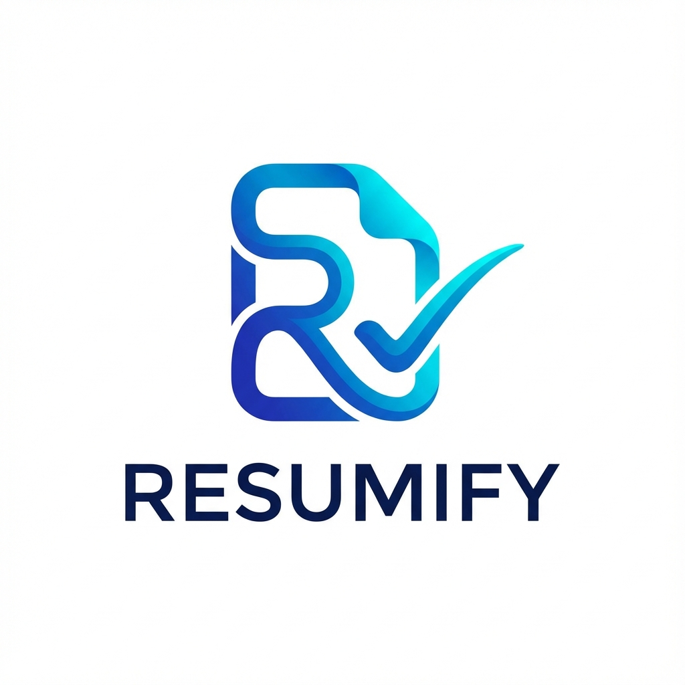

# 📄 Resumify - AI-Powered ATS Resume Builder

  
  
<em>Build professional, ATS-optimized resumes in minutes with AI-powered suggestions and modern templates.</em>

  
  

---

## ✨ Features

- **🚀 AI Smart Suggestions**: Real-time bullet-point generation for experience and skills using AI.
- **📈 ATS-Optimized Layouts**: Designed to pass through Applicant Tracking Systems with high scores.
- **🎨 Dynamic Customization**: Change themes, colors, and premium fonts (Inter, Outfit, etc.) instantly.
- **📄 Multi-Format Export**:
  - **PDF**: Pixel-perfect A4 printing with clean margins (no browser headers).
  - **DOCX**: High-quality Word documents for manual editing.
- **⚡ Real-time Preview**: See your changes instantly with a split-screen editor/preview layout.
- **🌍 Multi-language Support**: Add proficiency levels for multiple languages.

## 🛠️ Tech Stack

- **Frontend**: React.js, Vite
- **Styling**: Vanilla CSS, Styled JSX
- **Icons**: Lucide React
- **AI**: Google Gemini API
- **Exporting**: `docx` library, `file-saver`, Browser Print API

## 📸 Screenshots

## 🤝 Contributing

Contributions are welcome! Feel free to open issues or submit pull requests.

---

Made with ❤️ by Anindya Hazra

